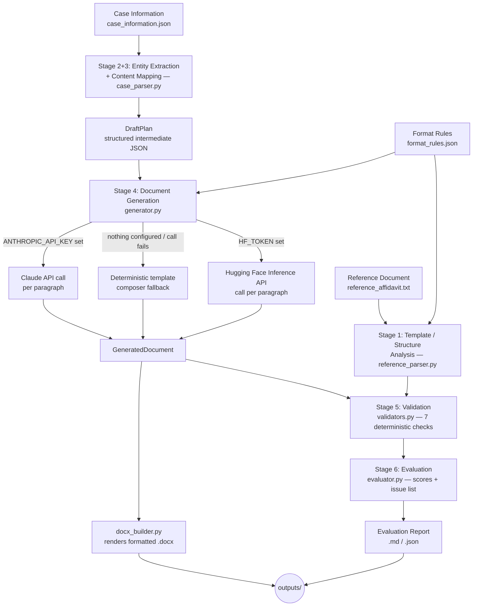

# Legal Document Generation & Evaluation Agent

A small AI-powered agent that takes a reference **Affidavit in Reply**, populates it with
new case facts, generates a fresh affidavit that preserves the reference's structure, and
then evaluates its own output against the format rules and the supplied facts — producing
a scored report with a list of concrete issues. Built as a proof of concept, not a
production drafting platform.

## What it does

1. Reads the reference affidavit and the format rules to understand the required structure
   (10 fixed parts, fixed phrases, two hard invariants).
2. Extracts case entities and reply points from a structured case-information file.
3. Maps those facts onto the fixed paragraph skeleton (identity → denial → preliminary
   position → substantive answers → closing).
4. Generates the new affidavit — either via the Claude API (if a key is supplied) or via a
   deterministic template composer (if not), and renders it to a formatted `.docx`.
5. Runs seven deterministic checks against the output and produces a scored evaluation
   report (`.md` and `.json`) with an issue list and a source reference for each issue.

## Setup

- Python 3.10+
- Install dependencies:
  ```bash
  pip install -r requirements.txt
  ```
- (Optional) copy `.env.example` to `.env` and configure **one** LLM provider — or none:
  - **Anthropic**: set `ANTHROPIC_API_KEY`
  - **Hugging Face**: set `HF_TOKEN` (and optionally `HF_MODEL`, default
    `meta-llama/Llama-3.1-8B-Instruct`) — uses the free HF Inference API
  - Leave both blank and the app runs in **template-fallback mode**, which still produces a
    complete result with no network call at all.
  - You can also paste a key/token directly into the running app's sidebar instead of using
    `.env`; the sidebar also lets you force a specific provider.
  - If both are set, Anthropic is used by default; force a specific one with
    `GENERATION_PROVIDER=anthropic|huggingface|template`.

## How to run

From a clean clone:

```bash
git clone <repo-url>
cd legal-doc-agent
pip install -r requirements.txt
streamlit run app.py
```

Or run the pipeline headlessly and inspect the files in `outputs/`:

```bash
python3 src/pipeline.py
```

Run the validator sanity tests (deliberately corrupts a clean document in known ways and
checks each rule catches it):

```bash
python3 tests/test_validators.py
```

## Working link

[Add your deployed Streamlit Community Cloud / HF Spaces link here.] Free-tier hosting
sleeps when idle — expect a ~30–60s cold start on first load.

## Video demo

[Add your Loom / Drive link here.]

## Architecture



## Design decisions

- **Case entity extraction is deterministic, not LLM-based.** `case_information.json` is
  already a labeled/tabular source, so parsing it with a schema (`case_parser.py`) is more
  reliable than an LLM re-reading it — it removes a whole class of extraction hallucination
  before generation even starts. The reference *document*, which is unstructured prose, is
  instead parsed with a structural/regex approach (`reference_parser.py`) since its sections
  are reliably marked by fixed headings — again avoiding an LLM call where a parser suffices.
  The LLM is reserved for the one stage that actually needs judgement: composing legal prose
  from bullet-point facts (`generator.py`).
- **A structured intermediate representation (`schemas.py`) sits between every stage**
  (`Entities` → `DraftPlan` → `GeneratedDocument`), rather than passing raw dicts around. This
  makes every stage's input/output explicit and testable in isolation.
- **The generator has a deterministic fallback, and is provider-agnostic.** If no LLM
  provider is configured (or a call fails), the app composes paragraphs directly from the
  same fixed-phrase bank the LLM prompt uses, so the demo never breaks and always produces a
  complete result — this is the "pre-run demo mode" the assignment brief allows for. Both
  Anthropic and Hugging Face are supported behind the same interface (`generator.generate()`);
  swapping providers only touches `generator.py` — the prompt, the constraint to only use
  supplied facts, and the fallback logic are identical either way. This was chosen over
  hard-coding a single provider so the assignment's "any LLM, hosted or local, free tiers are
  acceptable" allowance is actually usable without touching the rest of the pipeline.
- **Scoring is a transparent deduction scheme, not an LLM judge.** Each of the 6 dimensions
  starts at 100; each detected error/warning deducts 15/5 points; overall is the simple
  average. This was chosen over an LLM-graded score because it's reproducible and every point
  lost traces to a specific, explainable rule (see `evaluator.py`'s docstring). This was
  rejected in favor of a weighted scheme initially considered (weighting structure/consistency
  higher than template fidelity) — kept simple to stay defensible and easy to audit for a POC.
- **Seven deterministic checks** cover the assignment's minimum bar (three) with margin:
  respondent-number consistency, verification paragraph-range match, jurat/verification verb
  agreement, required-section presence, deponent-clause role phrasing (person vs. organisation),
  exhibit-reference completeness, and invented-respondent-number detection (a lightweight,
  no-LLM hallucination check). All seven are exercised by `tests/test_validators.py`, which
  deliberately corrupts a clean document and asserts each rule fires — and that a clean
  document produces zero false positives.

## What was rejected

- **An LLM-as-judge scoring pass** was considered for the evaluation stage but rejected for
  this POC: it would make the score non-reproducible run-to-run and harder to justify per the
  "explain how the score was calculated" requirement. A lightweight LLM hallucination pass is
  left as a natural extension point in `generator.py`/`evaluator.py` but isn't wired into
  scoring.
- **Para-wise reply to the original petition** — explicitly out of scope per the assignment.
- **Designing a format from scratch** — deliberately not done; the reference document and
  format-explainer are treated as the source of truth for structure.

## Known limitations

- Only one document type is supported (Affidavit in Reply, Bombay High Court writ format),
  as scoped. `format_rules.json` and the paragraph-move taxonomy are written generically
  enough that a second document type could reuse the same pipeline shape, but no second
  template is implemented.
- Neither LLM generation path (Anthropic or Hugging Face) is covered by an automated test in
  this repo, since both need a live network call and key; only the deterministic fallback
  path and the validators are tested here. Provider auto-detection, priority ordering, and
  the "SDK not installed -> fall back safely" behaviour *are* tested (see the bottom of
  `src/generator.py`'s dispatch logic), but the actual model calls are not.
- Free-tier Hugging Face Inference API models are noticeably weaker than Claude at strictly
  following "use only the supplied facts" — expect the hallucination-check dimension to catch
  more on that path. This is a real trade-off of the free/local option, not a bug.
- Template-fidelity scoring for the LLM path checks for the *presence* of at least one fixed
  phrase per section — it doesn't check phrase placement or grammar quality. That's a
  reasonable proxy for a POC, not a substitute for a human legal review.
- The `.docx` layout approximates court formatting conventions (bold/caps/centred headings,
  right-aligned tags via borderless tables) rather than reproducing exact court typesetting.
- No OCR/PDF-reference-ingestion is implemented — the reference and case data are consumed
  as plain text/JSON, prepared from the supplied PDFs ahead of time.

## AI assistant disclosure

This project was built with Claude (Anthropic) as a coding assistant — used for scaffolding
the pipeline modules, the validator logic, and this README.
